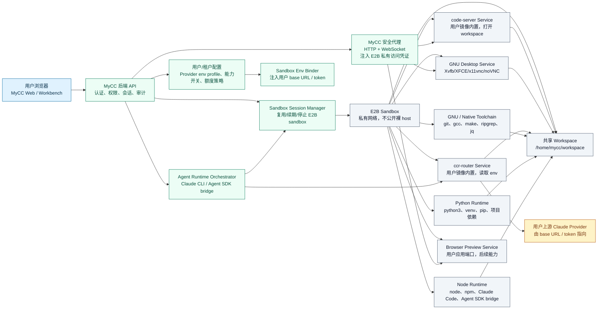
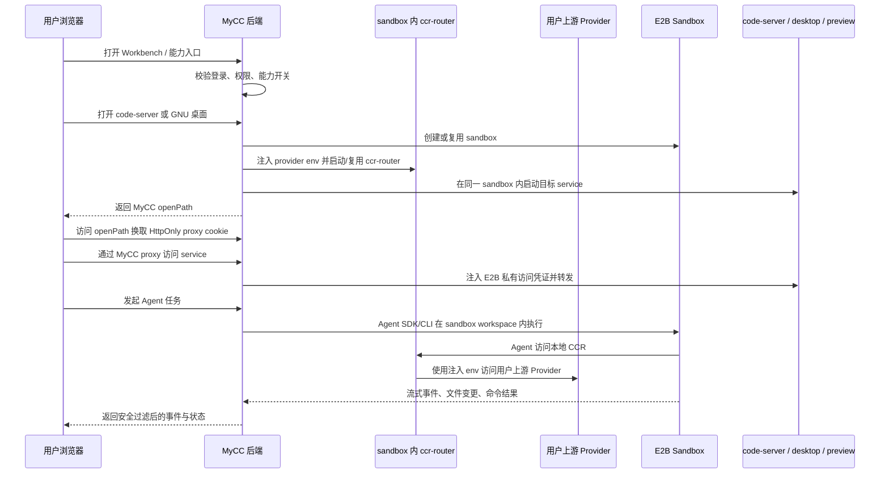

# MyCC E2B Desktop Architecture

Date: 2026-05-30
Branch: `codex/e2b-architecture-next`

## 目标

为 MyCC 增加 E2B Desktop / GNU 图形桌面能力，同时不回退现有 code-server、Claude CLI runtime、Claude Agent SDK bridge、CCR 和 MyCC 后端反代安全模型。

第一阶段只做能力设计和最小实现计划。实现时必须继续满足：

- 浏览器端不接触裸 E2B host、E2B traffic token、noVNC password、provider base URL 或 provider token。
- code-server 现有 `/api/ide` 路径保持兼容。
- 同一用户优先复用同一个 E2B sandbox，按需启动 ccr-router、code-server、desktop、后续 browser preview 等 service。
- 不直接并入 AGPL 项目源码；GUI 相关依赖走模板/系统包/官方 SDK，进入发布前许可证审计。

## 整体系统架构图

MyCC 这一层应当是控制面和安全入口，不是把所有能力都塞进浏览器，也不是让浏览器直接碰 E2B 或 provider。用户 Web 只访问 MyCC 暴露的同源 API；MyCC 后端负责创建 sandbox、注入运行时环境变量、启动用户镜像内的必要服务。CCR、code-server、Python/Node/GNU 工具链和 GNU desktop 都推荐放在用户 E2B 镜像里：CCR 作为 `ccr-router` service 根据注入的用户 base URL 和 token 路由 Claude/Agent 请求；code-server 作为 `code-server` service 打开同一个 workspace，供用户从 Web 查看、编辑对应工作空间的文件目录。

这个图里的核心边界：

- 用户浏览器不直接访问 E2B host、E2B traffic token、provider base URL 或 provider token。
- CCR 和 code-server 都是用户镜像内置的 sandbox service。MyCC 后端只负责把用户/租户 provider env 注入到 sandbox 或 ccr-router service，并启动/代理这些服务；Agent SDK/Claude CLI 默认访问 sandbox 内本地 CCR，而不是后端直连外部 CCR。
- E2B sandbox 是用户工作区运行环境，承载 ccr-router、code-server、GNU desktop、Python/Node/GNU 工具链和后续 browser preview。MyCC Web 的文件树、Monaco quick edit、code-server、Agent 和 desktop 都应指向同一个 workspace。
- ccr-router、code-server、desktop、preview 都是同一个 sandbox 下的 service/capability，而不是各自创建昂贵 sandbox。
- Python 这类运行环境不是单独产品入口，但要作为 template contract 和 doctor/smoke 的一等能力验证。

### 请求流

这个请求流决定了后续 API 的方向：Workbench 面向能力入口，后端面向 sandbox/service 编排，CCR/provider env 和 E2B 私有访问都留在后端与 sandbox 内部。

## 调研结论

### GNU 沙盒方案选择

第一阶段采用 E2B Cloud 托管 sandbox，而不是自建整套 GNU sandbox 云。MyCC 自己维护用户镜像/template，把 `ccr-router`、`code-server`、Python/Node/GNU 工具链和 desktop 依赖放进镜像里；MyCC 后端只通过 provider 抽象创建/复用 sandbox、注入 env、启动服务和代理访问。

这样可以先验证产品路径：

- 用户 Web 通过 MyCC 看同一个 workspace 的文件树和 code-server。
- Agent SDK/Claude CLI 在同一 sandbox 内访问本地 `ccr-router`。
- GNU desktop 和 browser preview 后续作为同一 sandbox 下的 service 扩展。

中长期保留自建可能性：如果未来需要成本、合规或私有化，可以把 `SandboxProvider` 从 E2B Cloud 替换成 E2B BYOC 或自建 Kubernetes + gVisor/Kata/Firecracker provider。前提是 MyCC API、workspace、service/capability 和 proxy 模型不变。

### 官方 E2B Desktop

官方 E2B Desktop 能力目前主要有两层：

- `e2b-dev/desktop` / `@e2b/desktop`：提供 Desktop Sandbox SDK，默认 template 名为 `desktop`，基于 Linux + Xfce，封装鼠标、键盘、截图、窗口和 noVNC stream。
- 官方示例模板：基于 Ubuntu 22.04、XFCE、VNC/noVNC streaming，可自定义依赖。

本地 npm 调研到 `@e2b/desktop` 当前包暴露：

- `Sandbox.create()` 或 `Sandbox.create(template, opts)`。
- `desktop.stream.start({ requireAuth })`。
- `desktop.stream.getUrl({ authKey })`。
- under the hood 使用 `x11vnc` + noVNC，noVNC 端口默认 `6080`，VNC 默认 `5900`。

这证明官方路线成熟，适合做参考和后续自动化能力来源；但第一阶段不建议直接把 `@e2b/desktop` 作为 MyCC product path 的主抽象。

原因：

- 默认 `desktop` template 不包含 MyCC 现有 code-server、Claude Code、Claude Agent SDK bridge、GNU/native toolchain 契约。
- SDK 的 stream URL 是 E2B host URL，哪怕有 noVNC auth key，也不能直接返回给 MyCC 浏览器端。
- 当前 MyCC provider 使用 `e2b` 基础 SDK 创建私有 sandbox 并由后端注入 `e2b-traffic-access-token`。直接切到 Desktop SDK 会扩大 code-server 主路径变更面。
- 当前数据模型把 sandbox 与 code-server session 绑定。直接引入 Desktop SDK 仍然需要先解耦数据模型，否则会重复创建昂贵 sandbox。

### 推荐方案

推荐采用“独立 MyCC assistant sandbox 镜像 + 后端统一 sandbox service 抽象”的混合方案：

1. 新增独立 `mycc-sandbox` 模块维护用户镜像/template，不把沙盒模板继续塞进 `mycc-backend/templates/e2b-code-server`。
2. 默认模板名使用 `mycc-assistant-sandbox-dev`，镜像内置 code-server、CCR、Claude Code、Claude Agent SDK bridge、Node、Python、browser-use、Playwright、Chromium、GNU/native tools 和 GNU desktop。
3. 后端继续用基础 `e2b` SDK 管理 sandbox 生命周期和私有网络，不把 E2B host/token 暴露给客户端。
4. 后端新增 `desktop` service 管理：在同一个 sandbox 内按需启动 Xvfb/XFCE/x11vnc/noVNC/websockify。
5. noVNC 只通过 MyCC 后端 proxy 打开。浏览器拿到的是 MyCC `openPath` 和 HttpOnly proxy cookie。
6. `@e2b/desktop` 暂不进入 product path；可作为参考实现、自动化 smoke 或未来“desktop automation provider”的候选依赖。

这个方案兼容现有安全模型，也为后续 GUI app stream、浏览器预览和截图/鼠标键盘控制留下扩展点。

## 当前系统观察

当前实现已经有一条完整 code-server product path：

- `mycc-backend/src/ide/e2b-provider.ts` 创建私有 E2B sandbox，启动 code-server，读取 provider host 和 traffic token。
- `mycc-backend/src/routes/ide.ts` 提供 `/api/ide/config`、session 创建/复用、open redirect、proxy、WebSocket upgrade。
- `mycc-backend/src/ide/session-store.ts` 将 `ide_sessions` 建模为 code-server session，字段包含 `code_server_pid`、`host`、`port`、`traffic_access_token`。
- `mycc-backend/src/routes/workspace.ts` 在 `MYCC_WORKSPACE_PROVIDER=e2b` 时复用 running IDE session 做文件树/read/write/exec。
- `mycc-backend/src/agent-runtime/e2b-claude-agent-sdk-runtime.ts` 和 `e2b-claude-cli-runtime.ts` 通过 `ensureE2bIdeSession` 复用或创建同一个 code-server sandbox。
- `mycc-web-react/src/components/WorkspacePage.tsx` 原本只有文件树、Monaco、代码编辑器入口。

关键问题是命名和存储层把 “sandbox session” 误认为 “IDE session”。Desktop 不是第二个 sandbox，而应该是同一 sandbox 的第二个 service。

目标架构里，code-server 也不是 MyCC 后端外置服务，而是用户镜像内的一个 sandbox service。MyCC 后端负责启动它、健康检查它，并通过 proxy 暴露给用户浏览器。`/api/workspace/tree`、`/api/workspace/file` 和 code-server 必须共享同一个 sandbox workspace，避免 Web 文件树看到的目录和 IDE/Agent 操作的目录不一致。

## 目标数据模型

推荐从 `ide_sessions` 演进为两层模型。

### `sandbox_sessions`

代表一个用户拥有的 E2B sandbox 生命周期。

建议字段：

- `id`
- `user_id`
- `provider`: 第一阶段固定 `e2b`
- `sandbox_id`
- `template`
- `linux_user`
- `workspace_dir`
- `traffic_access_token`: 生产建议加密或改成 secret reference
- `access_mode`: 固定 `mycc-proxy`
- `status`: `running | stopped | expired | error`
- `capabilities`: JSONB，例如 `ccr-router`、`code-server`、`desktop`、`browser-preview`
- `runtime_env_profile_id`: 当前 sandbox 绑定的 provider env profile，不保存明文 secret
- `expires_at`
- `stopped_at`
- `created_at`
- `updated_at`

### `sandbox_services`

代表同一 sandbox 中可独立启动/停止/代理的服务。

建议字段：

- `id`
- `sandbox_session_id`
- `service_type`: `ccr-router | code-server | desktop | browser-preview`
- `status`: `starting | running | stopped | error`
- `pid`
- `port`
- `health_path`
- `proxy_token`
- `started_at`
- `stopped_at`
- `last_checked_at`
- `metadata`: JSONB，例如 `display`、`vncPort`、`resolution`、`streamMode`

`metadata` 不保存 noVNC password、E2B token 或 provider URL。

### `runtime_env_profiles`

代表用户或租户给 sandbox 内 CCR 使用的 provider 环境配置。这个模型不是后端直连 provider，而是后端在启动 sandbox/service 时生成 env 注入。

建议字段：

- `id`
- `scope`: `user | tenant`
- `owner_id`
- `provider_kind`: `ccr | anthropic-compatible | custom`
- `display_name`
- `base_url_secret_ref`
- `token_secret_ref`
- `default_model`
- `status`: `active | disabled | error`
- `last_checked_at`
- `created_at`
- `updated_at`

明文 base URL 和 token 不进入普通 API response，不写日志。第一阶段可以先用现有后端 env 作为默认 profile，后续再加用户可配置的 profile UI。

### 迁移策略

第一阶段不要破坏 `ide_sessions`：

1. 先引入 TS 层 `SandboxSession` / `SandboxService` 类型和 store interface。
2. 用 adapter 将当前 `ide_sessions` 映射成一个 `sandbox_session + code-server service`，让 `/api/ide` 零行为回退。
3. 后续 migration 新增 `sandbox_sessions` 和 `sandbox_services`，新 session 双写或切读新表。
4. `runtime_env_profiles` 可先不迁移真实用户数据；先把当前环境变量解析成一个默认 profile，再逐步接入持久化。
5. 验证稳定后，`ide_sessions` 可保留为兼容 view 或只读历史表。

这样能让 code-server 主路径先不背数据库重构风险。

## 后端服务设计

### Provider 抽象

在 `E2bSandboxProvider` 上方新增更通用的 service 层，不直接删除现有方法。

目标方法：

- `ensureSandboxSession(user, options)`：复用 running sandbox；没有则创建 sandbox。
- `ensureRuntimeEnvProfile(user)`：解析用户/租户 provider env profile，返回 secret refs 或运行时 env，不返回给前端。
- `ensureService(session, 'ccr-router')`：在 sandbox 内启动或复用 CCR router service，并把用户 base URL/token 作为进程 env 注入。
- `ensureService(session, 'code-server')`：启动或复用 code-server service。
- `ensureService(session, 'desktop')`：启动或复用 desktop service。
- `runCommandInSandbox(session, command, options)`：现有 `runCommandInSession` 的泛化命名。
- `isServiceListening(session, service)`：按 service health 检查。
- `renewSandbox(session)`：续期整个 sandbox。
- `stopService(session, service)`：停止单个 service。
- `stopSandbox(session)`：停止 sandbox 和所有 service。

现有 `startCodeServer`、`stopCodeServer`、`renewCodeServer`、`isCodeServerListening` 继续保留为兼容 wrapper。

### CCR 启动命令

用户镜像内应预装 CCR 或 MyCC 认可的 router entrypoint。启动流程建议：

1. 从 `runtime_env_profile` 读取用户/租户 base URL 和 token 的 secret reference。
2. 后端只在启动 `ccr-router` service 时把明文放进进程 env，例如 `ANTHROPIC_BASE_URL`、`ANTHROPIC_AUTH_TOKEN` 或 CCR 自己的 env 名。
3. `ccr-router` 只监听 sandbox 内本地端口或私有链路，不直接暴露给浏览器。
4. Agent SDK bridge、Claude CLI、Claude Code 默认指向本地 CCR endpoint。
5. code-server/desktop 不应默认拿到上游 provider token；如果同一 Linux 用户能从 `/proc` 读取进程 env，需要把这点视作“用户 sandbox 内部可见”的信任边界，生产上优先用专用用户、受限权限或 secret file 权限收紧。

这让用户镜像具备可移植性：换上游 provider 只需要换 env/profile，不需要改 MyCC 后端主流程。

### Desktop 启动命令

模板内新增依赖后，desktop service 启动流程建议：

1. 确保 `DISPLAY` 存在，例如默认 `:1`。
2. 启动 X server，例如 `Xvfb`。
3. 启动 dbus + XFCE session。
4. 启动 `x11vnc` 连接本地 display。
5. 启动 noVNC/websockify 对外提供 web client。
6. health check 只检查 sandbox 内本地 noVNC 页面和进程，不读取或打印任何 secret。

端口建议配置化：

- code-server：保持当前 `18080`。
- noVNC web：新增默认端口，例如 `16080`。
- VNC 内部端口：新增默认端口，例如 `15900`。

避免让 desktop 依赖 code-server 启动；二者都是 sandbox service。

## 后端 API 设计

### 保持 `/api/ide`

现有 endpoint 不改对外语义：

- `GET /api/ide/config`
- `POST /api/ide/sessions`
- `GET /api/ide/sessions/current`
- `GET /api/ide/sessions/:id/open`
- `/api/ide/sessions/:id/proxy/*`

内部改为：

`ensureSandboxSession` -> `ensureService(ccr-router)` -> `ensureService(code-server)` -> 返回现有 public session shape。

`/api/workspace/*` 在 E2B 模式下也应复用同一个 `sandbox_session`，用后端受控命令读取同一 workspace，而不是另起 workspace 或依赖 code-server 内部 API。

### 第一阶段 Desktop API

第一阶段先在现有 `/api/ide` 下做兼容扩展，降低主路径迁移风险：

- `GET /api/ide/config` 返回 `desktopEnabled` 和 `desktopPort` 能力。
- `POST /api/ide/sessions` 继续创建或复用当前用户 running sandbox，并启动 code-server service。
- `POST /api/ide/sessions/:id/desktop` 在同一个 sandbox 内启动或复用 desktop service。
- `GET /api/ide/sessions/:id/desktop/open` 设置 desktop proxy 专属 HttpOnly cookie，然后 302 到 noVNC proxy landing page。
- `/api/ide/sessions/:id/desktop/proxy/*` 由 MyCC proxy 转发 noVNC HTTP 和 WebSocket。

行为：

- desktop 不直接创建第二个昂贵 sandbox，优先复用 code-server 已经建立的 `sandbox_id`。
- response 只返回公开 session/service 字段和 MyCC `openPath`。
- response 不返回 upstream host、traffic token、noVNC password、provider URL。
- proxy 注入 E2B traffic token，并支持 noVNC WebSocket upgrade。
- 第二阶段再考虑抽出 `/api/workbench/capabilities/*` 或 `/api/desktop/*`，避免一开始扩大 API 面。

### 后续统一 API

Workbench 可以逐步走统一能力接口：

- `GET /api/workbench/capabilities`
- `POST /api/workbench/capabilities/code-server/open`
- `POST /api/workbench/capabilities/desktop/open`
- `POST /api/workbench/capabilities/browser-preview/open`

也可以暴露只读 provider 状态：

- `GET /api/workbench/provider-status`

该接口只返回 profile 是否配置、health 状态、脱敏 display name 和默认模型，不返回 base URL/token。

这不是第一阶段必需，但数据模型要向这个方向靠。

## 前端入口设计

第一阶段只在 `WorkspacePage` / Workbench 入口增加一个“打开桌面工作间”按钮。

交互与现有代码编辑器入口一致：

- 点击时同步打开 placeholder tab，避免浏览器拦截。
- 调 `/api/ide/config` 确认 workspace 和 desktop capability enabled。
- 调 `/api/ide/sessions` 创建或复用 sandbox/code-server service。
- 调 `/api/ide/sessions/:id/desktop` 启动或复用 desktop service。
- 用 `resolveDesktopOpenUrl(openPath)` 导航 placeholder tab。
- 显示状态：未启用、就绪、启动中、已连接、错误。

第一阶段不内嵌 iframe。原因：

- noVNC 有 WebSocket、焦点、键盘快捷键和全屏行为，先新标签页风险最低。
- HttpOnly cookie + same-origin proxy 能直接复用当前安全模式。
- 后续内嵌前要确认 CSP、iframe sandbox、剪贴板、快捷键和移动端触控体验。

第二阶段再考虑：

- Workbench 右侧 `Capabilities` tab 内嵌 noVNC。
- 新窗口/弹窗式 desktop panel。
- Browser preview 与 GUI desktop 分离。

## Template Contract / Doctor / Smoke

### Template contract

在 `mycc-sandbox/templates/e2b-assistant-sandbox/contracts/template-contract.sh` 维护模板契约。契约分两层：

- `--ready`：E2B template ready command 的快速检查，确认关键 entrypoint 和基础命令存在。
- `--full`：doctor/smoke 使用的深检查，覆盖 Node、Python、browser automation、CCR、code-server 和 GNU desktop。

desktop 需要检查命令：

- `Xvfb`
- `startxfce4` 或 `xfce4-session`
- `x11vnc`
- `websockify` 或 noVNC `novnc_proxy`
- `dbus-launch`
- `xdpyinfo`
- 可选：`xdotool`、`xrandr`、`scrot`

CCR 需要检查：

- 用户镜像内存在 CCR/router entrypoint，例如 `ccr`、`claude-code-router` 或 MyCC 配置的 command。
- router 可在无真实 token 的 dry-run/config-check 模式启动，或者能输出版本信息。
- Agent SDK bridge 和 Claude CLI 可被配置为访问 sandbox 内本地 CCR endpoint。

Python 需要检查：

- `python3`
- `python3 -m venv`
- `pip`
- 基础 wheel/build 环境可用，至少能创建 venv 并运行一个小型脚本。

contract 只输出 ok/missing，不输出任何 host、token、password 或 base URL。

### Doctor

当前新增独立 sandbox doctor：

- `cd mycc-sandbox && npm run doctor:template`
- 检查 API key 是否存在但不打印值。
- 检查 E2B template 是否存在。
- 检查 template 文件、service scripts 和 executable bit。
- 检查 template contract 是否包含 ccr-router、desktop、Python 依赖。
- 检查 `@e2b/desktop` 如果被安装，只作为可选 automation dependency，不影响 product path。

### Smoke

当前新增 smoke：

- `cd mycc-sandbox && npm run smoke:local-contract`
- `cd mycc-sandbox && npm run smoke:e2b-template`
- 真实 E2B smoke 创建临时 sandbox，运行 full contract，启动 code-server，启动 GNU desktop/noVNC，执行 Playwright/Chromium 浏览器自动化，然后清理 sandbox。
- smoke 不调用 `getHost` 打印裸 E2B host，不打印 traffic token、provider token 或 provider base URL。

扩展 smoke：

- `smoke:e2b-agent-desktop-workspace`
- 在同一 sandbox 中先启动 ccr-router、Agent SDK/code-server，再启动 desktop。
- 验证返回的公开 `sandboxId` 相同。
- 验证 Agent 访问的是 sandbox 内本地 CCR endpoint，而不是 MyCC 后端直连外部 provider。
- 验证 workspace 文件由 agent、code-server、desktop command 共享同一路径。

## 安全边界

必须保持：

- E2B `allowPublicTraffic:false`。
- 后端 proxy 注入 E2B traffic token。
- 浏览器只接触 MyCC openPath、MyCC proxy path 和 HttpOnly cookie。
- noVNC password 如启用，只能在后端 service 内部使用，不作为 query string 暴露给 MyCC 前端。
- 不把 provider base URL 或 Claude/CCR credential 打到日志、doctor、smoke 或 API response。
- provider base URL/token 只作为 ccr-router 进程 env 或受限 secret file 注入 sandbox；Agent 命令优先只拿本地 CCR endpoint。
- 对 `/api/ide/sessions/:id/desktop/proxy/*` 和 WebSocket upgrade 使用与 code-server proxy 一致的 owner 校验。
- `DELETE` 行为默认只停 service；只有 sandbox cleanup 或最后一个 service 停止时才 kill sandbox。

## 扩展路径

### 内嵌 noVNC

第二阶段把 `openPath` 改为可 iframe 的 same-origin proxy 页面；增加 focus trap、全屏、剪贴板提示、移动端触控映射。

### Browser Preview

把 `browser-preview` 作为第三类 service：

- 用户应用端口通过 MyCC proxy 暴露。
- 与 desktop 分离，不要求启动 XFCE。
- 可支持多个 preview port，但第一阶段只做一个 active preview。

### GUI App Stream

在 desktop service metadata 中增加 `windowId` 或 `appName`：

- 全桌面 stream：默认。
- 应用窗口 stream：后续用 `xdotool`/窗口管理器查询 window id。
- 自动化控制：未来可引入 `@e2b/desktop` 的鼠标、键盘、截图 API，但仍通过 MyCC service/session 权限层调用。

## 最小实现计划

### Phase 0: 设计确认

- 审核本文档。
- 确认第一阶段采用独立 MyCC assistant sandbox template，不直接切主路径到 `@e2b/desktop`。
- 确认第一阶段沿用 `/api/ide` 兼容扩展，而不是立刻拆出独立 `/api/desktop`。

### Phase 1: 独立 sandbox 模块和 template contract

目标：`mycc-sandbox` 独立维护用户镜像，模板具备 AI 操作和 desktop 运行条件。

涉及文件：

- `mycc-sandbox/templates/e2b-assistant-sandbox/Dockerfile`
- `mycc-sandbox/templates/e2b-assistant-sandbox/template.ts`
- `mycc-sandbox/templates/e2b-assistant-sandbox/contracts/template-contract.sh`
- `mycc-sandbox/scripts/doctor-template.mjs`
- `mycc-sandbox/scripts/smoke-local-contract.mjs`
- `mycc-sandbox/scripts/smoke-e2b-template.mjs`
- `mycc-sandbox/test/sandbox-contract.test.mjs`

验证：

- `cd mycc-sandbox && npm test`。
- `cd mycc-sandbox && npm run smoke:local-contract`。
- `cd mycc-sandbox && npm run doctor:template`。
- `cd mycc-sandbox && npm run smoke:e2b-template`。
- doctor 不打印 secret/provider URL。
- contract 覆盖 CCR、Node、Python、browser-use、Playwright、Chromium、desktop 依赖。

### Phase 2: Sandbox service model adapter

目标：在 TS 层抽出 sandbox/service 概念，保持 DB 和 `/api/ide` 行为不变，并让 code-server/Agent 先经过 sandbox 内 ccr-router。

涉及文件：

- `mycc-backend/src/ide/e2b-provider.ts`
- `mycc-backend/src/ide/e2b-session.ts`
- `mycc-backend/src/ide/session-store.ts`
- `mycc-backend/src/routes/ide.ts`
- `mycc-backend/src/routes/workspace.ts`
- backend route/provider tests

验证：

- 现有 `/api/ide` tests 全过。
- code-server reusable session 行为不变。
- public response 仍不含 host/token。
- Agent runtime 注入本地 CCR endpoint，不把上游 provider env 返回给前端。

### Phase 3: Desktop backend API

目标：扩展 `/api/ide`，能在同一 sandbox 内启动 desktop service 并通过 MyCC proxy 打开 noVNC。

涉及文件：

- `mycc-backend/src/routes/ide.ts`
- `mycc-backend/src/ide/e2b-provider.ts`
- `mycc-backend/src/ide/session-store.ts`
- `mycc-backend/src/ide/service.ts`
- `mycc-backend/db/schema.sql`
- `mycc-backend/db/migrations/*`
- route/provider/store tests

验证：

- unit tests 覆盖复用 sandbox、desktop start、proxy 权限、WebSocket upgrade、secret 不泄露。
- sandbox smoke 覆盖 noVNC 可访问、desktop health 和浏览器自动化。

### Phase 4: Frontend entry

目标：Workspace/Workbench 增加“打开桌面工作间”入口，新标签页打开。

涉及文件：

- `mycc-web-react/src/components/WorkspacePage.tsx`
- `mycc-web-react/src/config/api.ts`
- `mycc-web-react/src/components/WorkspacePage.test.tsx`

验证：

- 点击同步打开 placeholder tab。
- desktop disabled 时按钮禁用。
- running desktop 显示已连接。
- open URL 只由 MyCC openPath 构造。

### Phase 5: DB migration

目标：在 desktop 路径稳定后，将当前 `ide_sessions + desktop_*` 兼容字段迁移到真正的 `sandbox_sessions + sandbox_services`。

涉及文件：

- `mycc-backend/db/migrations/*`
- `mycc-backend/db/schema.sql`
- `mycc-backend/src/ide/session-store.ts` 或新 store
- cleanup script
- release readiness docs

验证：

- migration 可重复应用。
- cleanup 能处理过期 sandbox 和 service。
- rollback 不需要 drop 旧表。

## 验收标准映射

- code-server 现有路径不回退：Phase 2 前后跑现有 `/api/ide` tests 和 smoke。
- E2B desktop 能在同一 sandbox 启动：Phase 3 route tests 和 smoke 验证 `sandboxId` 复用。
- 浏览器端不接触裸 host/token：route tests、frontend tests、smoke response scan。
- 新能力有测试/doctor/smoke 覆盖：Phase 1 + Phase 3。
- 后续内嵌 noVNC、browser preview、GUI app stream 有扩展路径：见扩展路径章节。
